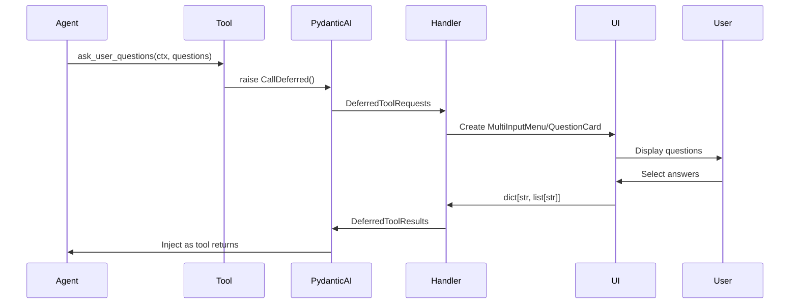

# `ask_user_questions` Tool Integration Guide

**Date:** 2026-02-21  
**Component:** QuestionCard  
**Purpose:** Integration documentation for RovoDev CLI `ask_user_questions` deferred tool

---

## Table of Contents

1. [Tool Overview](#tool-overview)
2. [Data Models (Input Contract)](#data-models-input-contract)
3. [Output Contract](#output-contract)
4. [Important Requirements](#important-requirements)
5. [Deferred Tool Execution Flow](#deferred-tool-execution-flow)
6. [QuestionCard Component Analysis](#questioncard-component-analysis)
7. [Integration Adapter Pattern](#integration-adapter-pattern)
8. [Summary & Compatibility](#summary--compatibility)

---

## Tool Overview

`ask_user_questions` is a **deferred tool** that allows AI agents to ask users multiple-choice questions during execution. It uses Pydantic AI's deferred execution pattern - the tool itself doesn't execute immediately but raises `CallDeferred()`, and the actual UI handling happens in a separate deferred tool handler.

### Key Use Cases

- Planning before implementation
- Gathering user preferences
- Clarifying ambiguous instructions
- Getting decisions on implementation choices
- Presenting options to users

### Tool Location

**File:** `packages/cli-rovodev/src/rovodev/modules/tools/ask_user_questions.py`

```python
async def ask_user_questions(
    ctx: RunContext[AcraMiniDeps], 
    questions_input: QuestionsInput
) -> dict[str, list[str]]:
    """Use this tool when you need to ask the user questions for planning purposes.

    Use this tool when you:
      - Need to plan your approach before starting implementation
      - Have finished analysis and need decisions before proceeding
      - Need to choose between multiple implementation approaches
      - Want user input on scope, priorities, or preferences
      - Are presenting options or alternatives to the user
      - Need clarification on ambiguous instructions

    The tool presents multiple-choice questions where users can select from
    predefined options. An "Other" option allowing custom text input is automatically
    added to each question - do NOT include an "Other" option in your provided choices.

    Args:
        questions_input: Structured input containing 1-4 questions with options.
                         Do not include "Other" as an option - it is added automatically.

    Returns:
        dict[str, list[str]]: Maps each question text to the user's selected answer(s).
    """
    if ctx.tool_call_id is None:
        raise ValueError("No tool id provided")

    # https://ai.pydantic.dev/deferred-tools/#external-tool-execution
    raise CallDeferred()
```

---

## Data Models (Input Contract)

The tool accepts structured input via Pydantic models:

```python
class QuestionOption(BaseModel):
    label: str = Field(
        description="Short option label (1-5 words)", 
        examples=["Bug Fix", "New Feature"]
    )
    description: str = Field(
        description="Detailed explanation of this option"
    )

class Question(BaseModel):
    question: str = Field(
        description="The question to ask the user. Keep the question short and to the point."
    )
    options: list[QuestionOption] = Field(min_length=1, max_length=4)
    header: str = Field(
        description="Short label shown above the question"
    )

class QuestionsInput(BaseModel):
    questions: list[Question]
```

### Example Input

```python
QuestionsInput(
    questions=[
        Question(
            question="What type of task are you working on?",
            header="Task Type",
            options=[
                QuestionOption(
                    label="Bug Fix", 
                    description="Fix an existing issue or defect in the codebase"
                ),
                QuestionOption(
                    label="New Feature", 
                    description="Implement new functionality or capabilities"
                ),
                QuestionOption(
                    label="Refactoring", 
                    description="Improve code structure without changing behavior"
                ),
            ]
        )
    ]
)
```

---

## Output Contract

The UI must return: `dict[str, list[str]]`

**Format:** Maps each question text to a list of selected answer(s)

### Example Response

```python
{
    "What type of task are you working on?": ["Bug Fix"],
    "What priority level?": ["High"]
}
```

### Special Response

If user cancels: Return string `"User did not respond to questions"`

---

## Important Requirements

### 1. Automatic "Other" Option

- **DO NOT** include an "Other" option in the predefined choices sent by the AI
- The UI **MUST** automatically add an "Other (enter custom input)" option to each question
- When user selects "Other", show a text input to capture custom response
- Custom responses should be stored as the answer value (not the marker `__CUSTOM_INPUT__`)

### 2. Multi-Question Support

- Support 1-4 questions per session
- Show question navigation if multiple questions
- Track which questions have been answered
- Allow navigation between questions

### 3. Validation

- Ensure all questions are answered before final submission
- Validate non-empty custom input
- Handle user cancellation gracefully

---

## Deferred Tool Execution Flow

This is **critical** to understand:



### Handler Code (Reference)

**File:** `packages/cli-rovodev/src/rovodev/commands/run/command.py` (line 2285+)

```python
async def _handle_deferred_tools(
    request: DeferredToolRequests,
    session_ctx: SessionContext[AcraMiniDeps],
) -> DeferredToolResults | None:
    result = DeferredToolResults()
    
    for tool_part in request.calls:
        if tool_part.tool_name == "ask_user_questions":
            questions = QuestionsInput.model_validate(tool_part.args_as_dict())
            multi_menu = MultiInputMenu(
                questions=questions.questions,
                border_color="none",
                title_color="none",
            )
            user_response = await multi_menu.run()
            result.calls[tool_part.tool_call_id] = user_response
            
    return result
```

---

## QuestionCard Component Analysis

### Component Types

```typescript
export interface QuestionCardOption {
  /** Unique identifier for this option. */
  id: string;
  /** Display label for the option. */
  label: string;
  /** Optional secondary description shown below the label. */
  description?: string;
}

export interface QuestionCardQuestion {
  /** Unique identifier for this question. */
  id: string;
  /** The question text displayed as a heading. */
  label: string;
  /** Short category label displayed above the question (e.g., "Scope", "Compatibility"). */
  header?: string;
  /** Selection mode. `"single-select"` auto-advances; `"multi-select"` shows checkboxes. */
  kind: "single-select" | "multi-select" | "text";
  /** Pre-defined answer options. */
  options: ReadonlyArray<QuestionCardOption>;
}

export type QuestionCardAnswerValue = string | string[];
export type QuestionCardAnswers = Record<string, QuestionCardAnswerValue>;
```

### Component Props

```typescript
export interface QuestionCardProps {
  /** Ordered list of questions to present. */
  questions: ReadonlyArray<QuestionCardQuestion>;
  /** When `true`, all interactions are disabled and a loading state is shown. */
  isSubmitting?: boolean;
  /** Called with the collected answers when the user completes all questions or clicks Submit. */
  onSubmit: (answers: QuestionCardAnswers) => void;
  /** Called when the user dismisses the card (Escape or Skip on last question). */
  onDismiss?: () => void;
  /** Maximum number of pre-defined options to display per question. @default 4 */
  maxVisibleOptions?: number;
  /** Placeholder text for the free-form custom input row. @default "Tell Rovo what to do..." */
  customInputPlaceholder?: string;
  /** Whether to show the free-form custom input row after the option list. @default true */
  showCustomInput?: boolean;
  /** Initial answers to pre-populate. Keys are question IDs. */
  defaultAnswers?: QuestionCardAnswers;
}
```

---

## ✅ What QuestionCard Supports

### 1. Input Data Model Compatibility

| Tool Model | QuestionCard Component | Status |
|---|---|---|
| `QuestionOption.label` | `QuestionCardOption.label` | ✅ Perfect match |
| `QuestionOption.description` | `QuestionCardOption.description` | ✅ Perfect match |
| `Question.question` | `QuestionCardQuestion.label` | ✅ Maps correctly |
| `Question.header` | `QuestionCardQuestion.header` | ✅ Perfect match |
| `Question.options` (1-4 items) | `QuestionCardQuestion.options` | ✅ Has validation |

**Note:** Component has `kind: "single-select" | "multi-select" | "text"` which the tool doesn't specify but is a smart extension.

### 2. Auto-Added "Other" Option

✅ **Fully supported** via `showCustomInput` prop (defaults to `true`)

- Component automatically adds a custom input row after predefined options
- Placeholder: `"Tell Rovo what to do..."` (customizable)
- Custom input is properly isolated from predefined options
- When user enters custom text, it's stored as the answer value

### 3. Multi-Question Support

✅ **Fully supported**

- Supports 1-4+ questions
- Navigation buttons (← Previous, Next →)
- Progress indicator (e.g., "1 of 3")
- Question header displayed
- Answers preserved when navigating between questions

### 4. Question Navigation

✅ **Comprehensive support**

- Arrow keys (← →) move between questions
- Previous/Next buttons with proper disabled states
- Can navigate back to previous questions
- Answers are retained during navigation

### 5. Keyboard Navigation

✅ **Excellent keyboard support**

- ↑/↓: Navigate options within a question
- ←/→: Navigate between questions
- Enter: Select option (single-select auto-advances)
- Esc: Can dismiss via optional `onDismiss` callback
- Tab: Focus management

### 6. User Cancellation

✅ **Supported via optional `onDismiss` callback**

- Shows X button in header (when `onDismiss` is provided)
- Can be dismissed without completing all questions

---

## ⚠️ Gaps & Required Adaptations

### 1. Return Format Translation

**Issue:** Tool expects question **text** as keys; component uses question **ID**

```typescript
// Tool expects:
{
  "What type of task are you working on?": ["Bug Fix"],
  "What priority level?": ["High"]
}

// Component returns:
{
  "task-type-id": "Bug Fix",
  "priority-id": "High"
}
```

**Solution:** Add an adapter function (see [Integration Adapter Pattern](#integration-adapter-pattern))

### 2. Single-Select Should Return Array

**Issue:** Component returns `string` for single-select, but tool expects `string[]` (list)

**Current behavior:**
```typescript
// Single-select stores as string
answers["question-id"] = "Bug Fix"

// Tool expects
{"Question text": ["Bug Fix"]}
```

**Solution:** Normalize in adapter

### 3. Dismissal/Cancellation Response

**Issue:** Tool expects specific cancellation response format

When user cancels, component calls `onDismiss()`, but need to return:
```typescript
"User did not respond to questions"
```

**Solution:** In the deferred handler, if `onDismiss` is triggered, return this string instead of the answers object.

### 4. Empty Custom Input Validation

✅ **Already handled** in the hook:
```typescript
if (isSubmitting || !value.trim()) return;  // Line 124 in use-question-card.ts
```

---

## Integration Adapter Pattern

### Adapter Function

```typescript
/**
 * Adapts QuestionCard answers to the format expected by ask_user_questions tool
 */
function adaptAnswersForTool(
  answers: QuestionCardAnswers,
  questions: ReadonlyArray<QuestionCardQuestion>
): Record<string, string[]> {
  return Object.entries(answers).reduce((acc, [questionId, value]) => {
    const question = questions.find(q => q.id === questionId);
    if (question) {
      // Use question.label as key (tool expects question text, not ID)
      // Always normalize to string[] (tool expects list, not single value)
      acc[question.label] = Array.isArray(value) ? value : [value];
    }
    return acc;
  }, {} as Record<string, string[]>);
}
```

### Convert Tool Input to QuestionCard Format

```typescript
/**
 * Converts tool's QuestionsInput to QuestionCard format
 */
function convertToolInputToQuestionCard(
  toolInput: QuestionsInput
): QuestionCardQuestion[] {
  return toolInput.questions.map((q, idx) => ({
    id: `q-${idx}`,  // Generate unique IDs
    label: q.question,
    header: q.header,
    kind: "single-select",  // Default to single-select
    options: q.options.map((opt, optIdx) => ({
      id: `opt-${idx}-${optIdx}`,
      label: opt.label,
      description: opt.description,
    })),
  }));
}
```

### Full Integration Example

```typescript
// In deferred tool handler (e.g., API endpoint or CLI handler)
async function handleDeferredTools(
  request: DeferredToolRequests
): Promise<DeferredToolResults> {
  const result: DeferredToolResults = { calls: {} };
  
  for (const toolCall of request.calls) {
    if (toolCall.tool_name === "ask_user_questions") {
      // Parse tool input
      const toolInput = parseQuestionsInput(toolCall.args);
      
      // Convert to QuestionCard format
      const questionCardQuestions = convertToolInputToQuestionCard(toolInput);
      
      // Create a promise to wait for user response
      const userResponse = await new Promise<QuestionCardAnswers | "cancelled">(
        (resolve) => {
          renderQuestionCard({
            questions: questionCardQuestions,
            showCustomInput: true,
            maxVisibleOptions: 4,
            onSubmit: (answers) => resolve(answers),
            onDismiss: () => resolve("cancelled"),
          });
        }
      );
      
      // Handle response
      if (userResponse === "cancelled") {
        result.calls[toolCall.tool_call_id] = "User did not respond to questions";
      } else {
        // Adapt format back to tool expectations
        result.calls[toolCall.tool_call_id] = adaptAnswersForTool(
          userResponse,
          questionCardQuestions
        );
      }
    }
  }
  
  return result;
}
```

### Type Definitions for Integration

```typescript
// Add to your types file
interface QuestionsInput {
  questions: Question[];
}

interface Question {
  question: string;
  header: string;
  options: QuestionOption[];
}

interface QuestionOption {
  label: string;
  description: string;
}

interface DeferredToolCall {
  tool_call_id: string;
  tool_name: string;
  args: unknown;
}

interface DeferredToolRequests {
  calls: DeferredToolCall[];
}

interface DeferredToolResults {
  calls: Record<string, unknown>;
}
```

---

## Summary & Compatibility

### Compatibility Matrix

| Feature | Tool Requires | QuestionCard | Status |
|---------|---|---|---|
| Multiple choice questions | ✅ | ✅ | ✅ Full support |
| 1-4 predefined options | ✅ | ✅ | ✅ Full support |
| Option labels & descriptions | ✅ | ✅ | ✅ Full support |
| Auto-add "Other" option | ✅ | ✅ | ✅ Full support |
| Custom text input | ✅ | ✅ | ✅ Full support |
| Multi-question flow | ✅ | ✅ | ✅ Full support |
| Progress indication | ✅ | ✅ | ✅ Full support |
| Question navigation | ✅ | ✅ | ✅ Full support |
| Keyboard shortcuts | ✅ | ✅ | ✅ Full support |
| User cancellation | ✅ | ✅ (optional) | ✅ Supported |
| Return `dict[str, list[str]]` | ✅ | Partial | ⚠️ Needs adapter |
| Validate all answered | ✅ | ✅ | ✅ Full support |

### Overall Assessment

**Compatibility Score: ~95%** 🎉

The QuestionCard component is **excellent** for this tool and requires only minor adaptations:

1. ✅ **Strengths:**
   - Perfect UX/UI alignment with tool requirements
   - Comprehensive keyboard navigation
   - Multi-question flow with progress tracking
   - Built-in custom input handling
   - Proper validation and state management

2. ⚠️ **Required Work:**
   - Format adapter functions (straightforward to implement)
   - Integration glue code for deferred tool handler
   - Type definitions for tool contracts

3. 🚀 **Recommendations:**
   - Create adapter module (`lib/tool-adapters.ts`)
   - Add integration tests with mock tool data
   - Consider supporting multi-select mode for tool
   - Add timeout/session handling for long-running requests

---

## Next Steps

1. **Implement adapter functions** in a new file: `lib/tool-adapters.ts`
2. **Create integration layer** in your API/handler code
3. **Add TypeScript types** for tool contracts
4. **Write integration tests** using example tool inputs
5. **Test with real deferred tool flow** in development environment

---

## References

- **Tool Implementation:** `packages/cli-rovodev/src/rovodev/modules/tools/ask_user_questions.py`
- **Tool Tests:** `packages/cli-rovodev/tests/modules/tools/test_ask_user_questions.py`
- **Deferred Handler:** `packages/cli-rovodev/src/rovodev/commands/run/command.py` (line 2285+)
- **Data Models:** `packages/cli-rovodev/src/rovodev/ui/components/multi_input_menu.py`
- **CLI Callback:** `packages/code-nemo/src/nemo/callbacks/cli_callback.py` (line 912+)

---

**Document Version:** 1.0  
**Last Updated:** 2026-02-21  
**Maintained by:** VPK-rovodev Team
