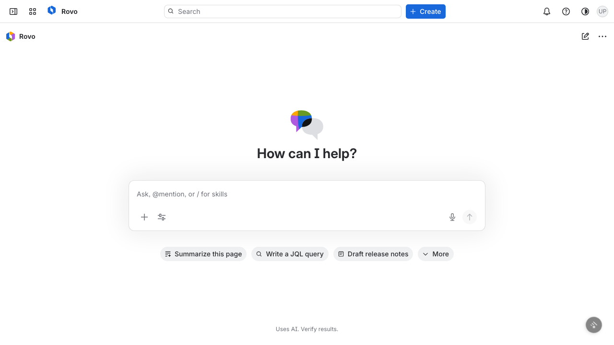
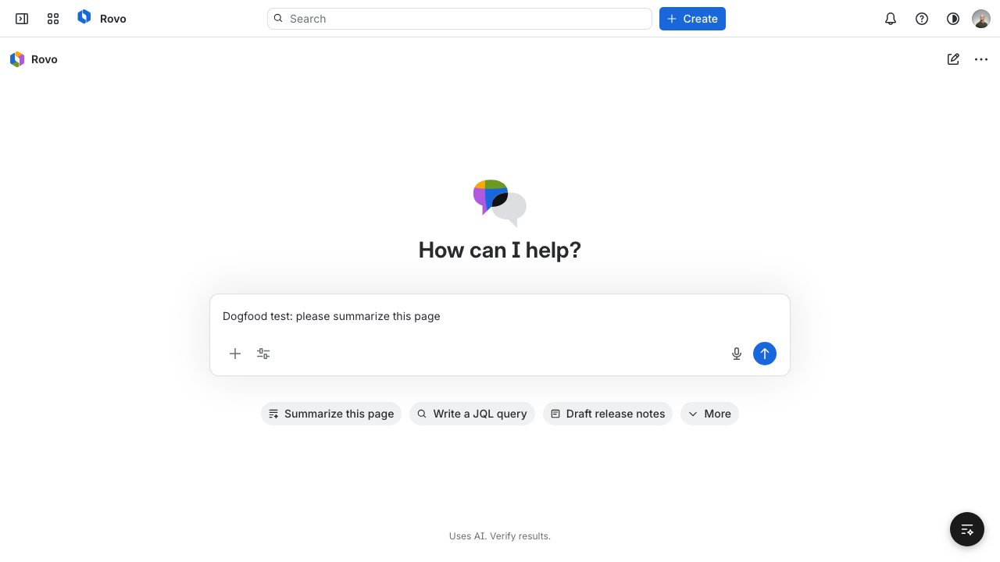
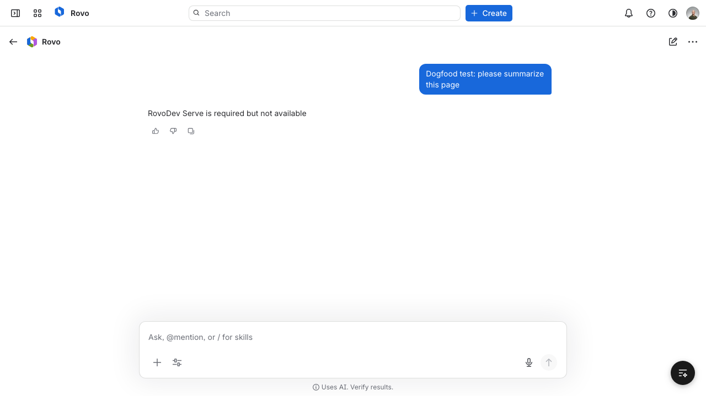
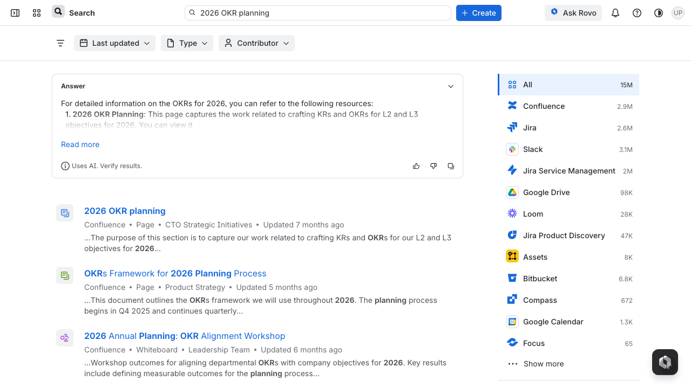
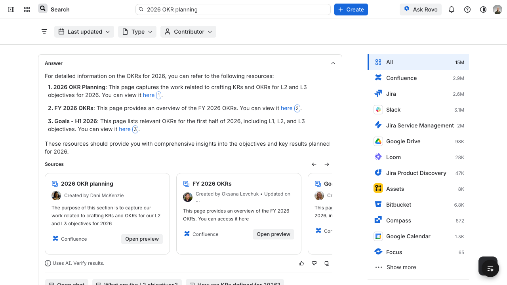
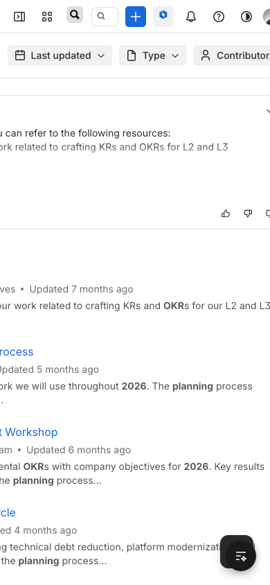
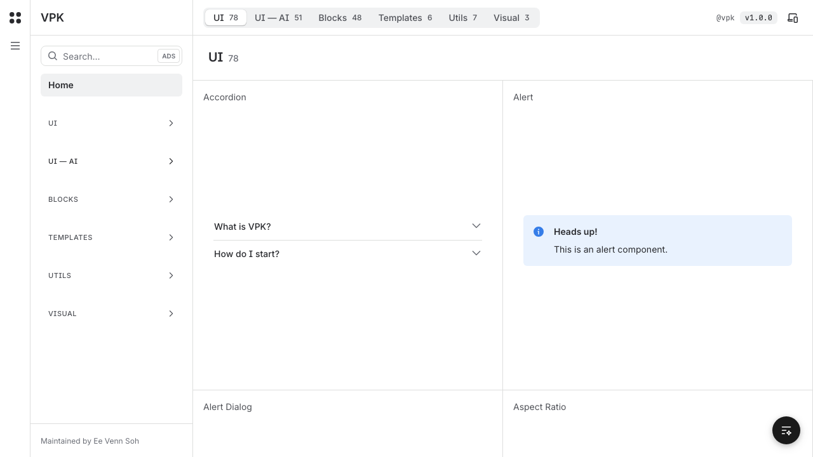
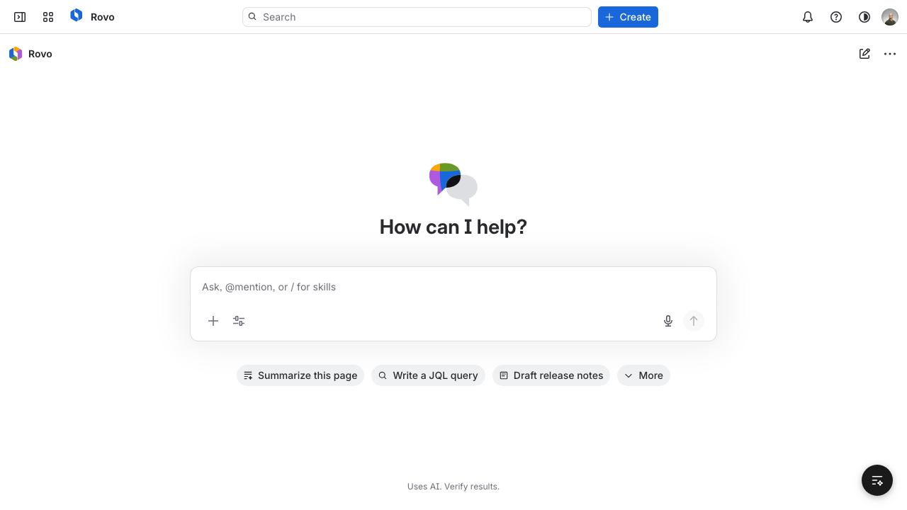

# Dogfood Report: VPK RovoDev Local App

| Field | Value |
|-------|-------|
| **Date** | 2026-02-25 |
| **App URL** | http://localhost:3000 |
| **Session** | localhost-3000 |
| **Scope** | Full app exploratory QA |

## Summary

| Severity | Count |
|----------|-------|
| Critical | 0 |
| High | 1 |
| Medium | 2 |
| Low | 2 |
| **Total** | **5** |

## Issues

### ISSUE-001: Chat send fails with 503 (core workflow blocked)

| Field | Value |
|-------|-------|
| **Severity** | high |
| **Category** | functional |
| **URL** | http://localhost:3000/fullscreen-chat |
| **Repro Video** | videos/issue-001-repro.webm |

**Description**

Sending a message in fullscreen chat consistently fails and returns `RovoDev Serve is required but not available`. Expected behavior is a successful response or a clear in-product recovery path. Actual behavior blocks core chat usage.

**Repro Steps**

1. Navigate to fullscreen chat.
   

2. Enter a message in the chat input.
   

3. Submit the message.
   

4. **Observe:** assistant response shows service-unavailable error; console includes HTTP 503.
   

Console evidence: `issue-001-console.txt`

---

### ISSUE-002: Search answer source links are dead anchors

| Field | Value |
|-------|-------|
| **Severity** | medium |
| **Category** | functional |
| **URL** | http://localhost:3000/search |
| **Repro Video** | videos/issue-002-repro.webm |

**Description**

The inline `here` links in the expanded answer do not open source documents. Expected behavior is navigation to a source page or preview. Actual behavior only changes the URL to a hash (`/search#`) with no content change.

**Repro Steps**

1. Navigate to search results page.
   

2. Click `Read more` to expand the answer.
   

3. Click one of the inline `here` links.
   

4. **Observe:** page does not navigate to source content; URL becomes `http://localhost:3000/search#`.
   

URL evidence: `issue-002-url.txt`

---

### ISSUE-003: Mobile layout is clipped with persistent right-side black gutter

| Field | Value |
|-------|-------|
| **Severity** | medium |
| **Category** | visual |
| **URL** | http://localhost:3000/search (390x844 viewport) |
| **Repro Video** | N/A |

**Description**

On narrow mobile viewport, the app does not occupy full width and leaves a large black gutter on the right. Content is clipped and partially inaccessible, indicating responsive layout overflow.

---

### ISSUE-004: Console spam on page load (`ERR_CONNECTION_REFUSED` + Agentation fetch failure)

| Field | Value |
|-------|-------|
| **Severity** | low |
| **Category** | console |
| **URL** | http://localhost:3000/ |
| **Repro Video** | N/A |

**Description**

A clean home-page load immediately emits console errors and warnings, including repeated `Failed to load resource: net::ERR_CONNECTION_REFUSED` and Agentation session fetch failures. This adds noise and can hide real defects.

Console evidence: `issue-005-console.txt`

---

### ISSUE-005: Next/Image aspect-ratio warning on chat illustration

| Field | Value |
|-------|-------|
| **Severity** | low |
| **Category** | console |
| **URL** | http://localhost:3000/fullscreen-chat |
| **Repro Video** | N/A |

**Description**

Loading fullscreen chat triggers a Next.js image warning for `/illustration-ai/chat/light.svg` indicating width/height are being modified inconsistently. This signals a rendering/configuration issue in image sizing.

Console evidence: `issue-006-console.txt`

---
