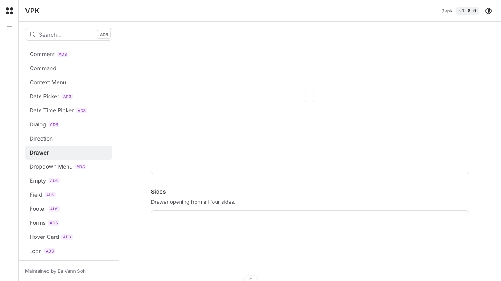
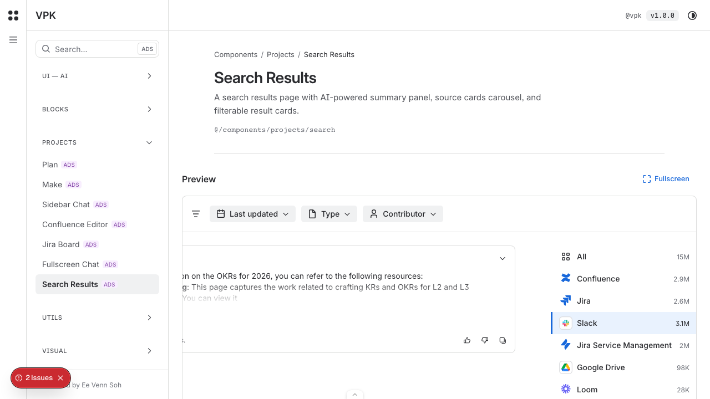
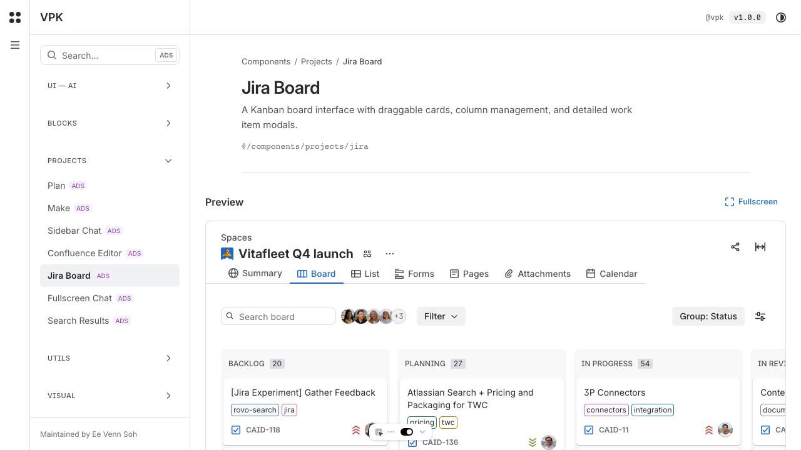
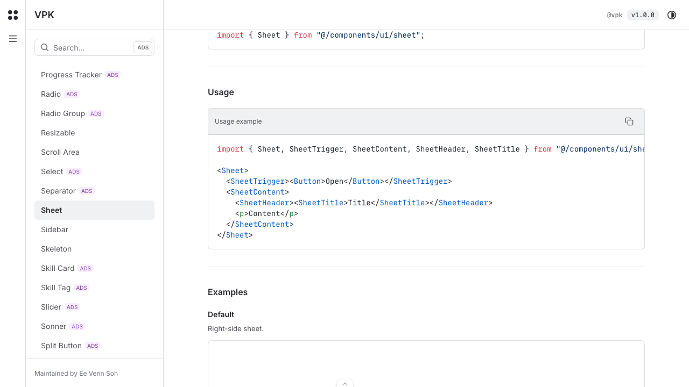
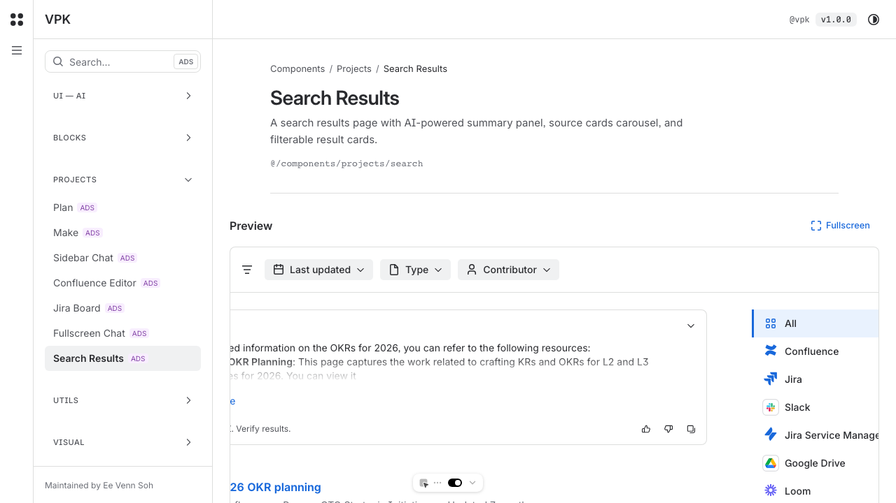

# Dogfood Report: VPK local app

| Field | Value |
|-------|-------|
| **Date** | 2026-03-07 |
| **App URL** | http://localhost:3000 |
| **Session** | localhost-3000 |
| **Scope** | Core logged-out app flows |

## Summary

| Severity | Count |
|----------|-------|
| Critical | 0 |
| High | 1 |
| Medium | 4 |
| Low | 0 |
| **Total** | **5** |

## Issues

### ISSUE-001: Drawer side triggers render as unlabeled empty squares

| Field | Value |
|-------|-------|
| **Severity** | high |
| **Category** | accessibility |
| **URL** | http://localhost:3000/components/ui/drawer |
| **Repro Video** | N/A |

**Description**

In the `Sides` example on the drawer page, the trigger controls render as empty square buttons with no visible label or icon. The expected behavior is a discoverable trigger with a visible affordance and an accessible name. The actual result is a blank control that is hard to discover visually, and an accessibility scan on the same page flags critical `button-name` failures on multiple drawer triggers.

**Repro Steps**

1. Navigate to http://localhost:3000/components/ui/drawer and scroll to the `Sides` example.

2. **Observe:** the trigger is shown as an empty square with no visible label or icon.
   

---

### ISSUE-002: Search results summary text is clipped off the left edge

| Field | Value |
|-------|-------|
| **Severity** | medium |
| **Category** | visual |
| **URL** | http://localhost:3000/components/projects/search |
| **Repro Video** | N/A |

**Description**

The AI summary card in the Search Results preview should present readable summary text. Instead, the content starts mid-sentence and is visibly cropped by the left edge of the card, which makes the main explanatory content hard to read in the default state.

**Repro Steps**

1. Navigate to http://localhost:3000/components/projects/search.

2. **Observe:** the summary body begins mid-sentence because the left side of the text block is clipped.
   

---

### ISSUE-003: Jira board preview cuts off the rightmost status column

| Field | Value |
|-------|-------|
| **Severity** | medium |
| **Category** | ux |
| **URL** | http://localhost:3000/components/projects/jira |
| **Repro Video** | N/A |

**Description**

The Jira board preview should show each status column clearly or provide an obvious horizontal-scroll affordance. In the default viewport, the rightmost column is truncated and its cards are partially off-canvas, so part of the board cannot be reviewed without extra guesswork.

**Repro Steps**

1. Navigate to http://localhost:3000/components/projects/jira.

2. **Observe:** the far-right column title is cut off and the column content extends outside the visible frame.
   

---

### ISSUE-004: Sheet usage code block is scrollable but not keyboard-focusable

| Field | Value |
|-------|-------|
| **Severity** | medium |
| **Category** | accessibility |
| **URL** | http://localhost:3000/components/ui/sheet |
| **Repro Video** | N/A |

**Description**

The `Usage` code example contains horizontally scrollable content, so keyboard users need a way to focus the region before they can inspect overflowed code. A page-level accessibility scan flags `scrollable-region-focusable` on this code block, which means the overflow container is not keyboard-accessible in its current state.

**Repro Steps**

1. Navigate to http://localhost:3000/components/ui/sheet and scroll to the `Usage` section.

2. **Observe:** the code example is presented in a scrollable region without keyboard focus support.
   

---

### ISSUE-005: Persistent layout landmarks are ambiguous across component pages

| Field | Value |
|-------|-------|
| **Severity** | medium |
| **Category** | accessibility |
| **URL** | http://localhost:3000/components/projects/search |
| **Repro Video** | N/A |

**Description**

The shared application shell should expose a clear landmark structure for screen-reader users. Instead, repeated scans on component/project pages flag duplicate unlabeled navigation landmarks and persistent shell content outside landmark regions. That makes landmark-based navigation less reliable across the app, especially on pages like Search Results and Jira Board where the shell stays constant.

**Repro Steps**

1. Navigate to http://localhost:3000/components/projects/search or another component detail page.

2. **Observe:** the shared header, sidebar, and footer shell surrounds the page content, but accessibility scans flag ambiguous landmark structure on this layout.
   

---
